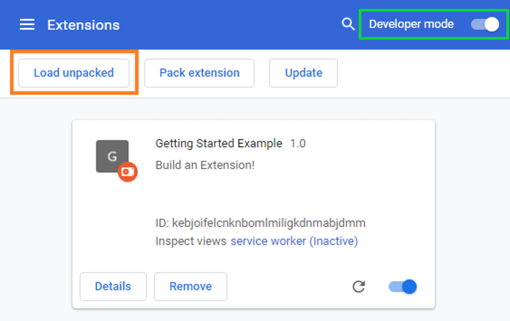

# pdf_dark-mode
 inverts the colors of the page

# installation
 ## open chrome://extensions
  Open the Extension Management page by navigating to [chrome://extensions](chrome://extensions).
  
  or
  
  Alternatively, open this page by clicking on the Extensions menu button and selecting Manage Extensions at the bottom of the menu.
  
  or
  
  Alternatively, open this page by clicking on the Chrome menu, hovering over More Tools then selecting Extensions

 ## toggle Developers mode
  Enable Developer Mode by clicking the toggle switch next to Developer mode.

 ## select the directory
  Click the Load unpacked button and select the extension directory.
  

 ## you are good to go👍
